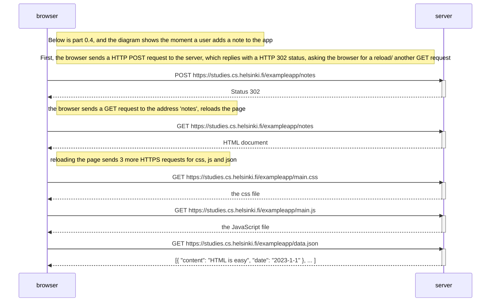

```mermaid
    sequenceDiagram
        participant browser
        participant server

        Note right of browser: Below is part 0.4, and the diagram shows the moment a user adds a note to the app

        Note right of browser: First, the browser sends a HTTP POST request to the server, which replies with a HTTP 302 status, asking the browser for a reload/ another GET request
        browser->>server: POST https://studies.cs.helsinki.fi/exampleapp/notes
        activate server
        server-->>browser: Status 302
        deactivate server

        Note right of browser: the browser sends a GET request to the address 'notes', reloads the page
        browser->>server: GET https://studies.cs.helsinki.fi/exampleapp/notes
        activate server
        server-->>browser: HTML document
        deactivate server

        Note right of browser: reloading the page sends 3 more HTTPS requests for css, js and json
        browser->>server: GET https://studies.cs.helsinki.fi/exampleapp/main.css
        activate server
        server-->>browser: the css file
        deactivate server

        browser->>server: GET https://studies.cs.helsinki.fi/exampleapp/main.js
        activate server
        server-->>browser: the JavaScript file
        deactivate server

        browser->>server: GET https://studies.cs.helsinki.fi/exampleapp/data.json
        activate server
        server-->>browser: [{ "content": "HTML is easy", "date": "2023-1-1" }, ... ]
        deactivate server
```